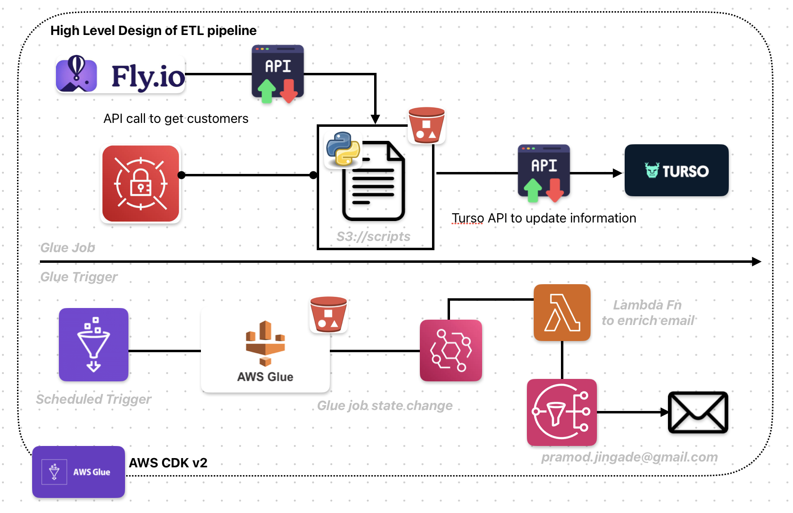

# AWS Glue Pipeline

AWS CDK v2 stack code snippet, which creates a Glue Job pipeline

# CDK Resources

The following is the list of resources, verified by running `./aws/test/glue_pipeline.test.ts`:

- S3BucketStack
  - ✓ creates S3 bucket with correct configuration when createBucket=true (35 ms)
  - ✓ bucket name is lowercase and uses hyphens (4 ms)
  - ✓ bucket name does not contain underscores (3 ms)
  - ✓ enforces SSL via bucket policy (2 ms)
  - ✓ bucket has RETAIN removal policy (3 ms)
  - ✓ references existing bucket when createBucket=false (25 ms)
  
- SecretsStack
  - ✓ creates Secrets Manager secret (3 ms)
  - ✓ secret name matches pipeline prefix (2 ms)
  - ✓ secret contains required credential keys (2 ms)
  - ✓ secret has project tag (2 ms)
  
- IamStack
  - ✓ creates IAM role for Glue (15 ms)
  - ✓ role name matches pipeline prefix (11 ms)
  - ✓ role has AWSGlueServiceRole managed policy (5 ms)
  - ✓ role has S3 read/write permissions on scripts bucket (5 ms)
  - ✓ role has SecretsManager read permissions (5 ms)
  
- GlueStack
  - ✓ creates a Glue job (11 ms)
  - ✓ Glue job uses correct version and worker type (7 ms)
  - ✓ Glue job uses Python 3 glueetl command (8 ms)
  - ✓ Glue job script location points to S3 scripts prefix (8 ms)
  - ✓ Glue job default arguments include APP_SECRETS_ARN (7 ms)
  - ✓ Glue job has max concurrent runs = 1 (9 ms)
  - ✓ creates a scheduled Glue trigger (6 ms)
  - ✓ trigger references the correct Glue job (7 ms)
  - ✓ stack has GlueJobName CfnOutput (8 ms)
  
- NotificationStack
  - ✓ creates SNS topic (43 ms)
  - ✓ SNS topic has email subscription (6 ms)
  - ✓ creates Lambda function with correct runtime (5 ms)
  - ✓ Lambda function name matches pipeline prefix (8 ms)
  - ✓ Lambda role has SNS publish permission (5 ms)
  - ✓ Lambda role has glue:GetJobRun permission (5 ms)
  - ✓ Lambda role has VPC execution managed policy (5 ms)
  - ✓ creates EventBridge success rule (7 ms)
  - ✓ creates EventBridge failure rule (5 ms)
  - ✓ EventBridge rules target the Lambda function (6 ms)
  - ✓ security group allows all outbound traffic (5 ms)
  - ✓ stack has Lambda and SNS ARN outputs (5 ms)
